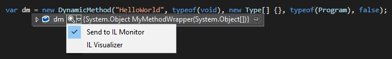
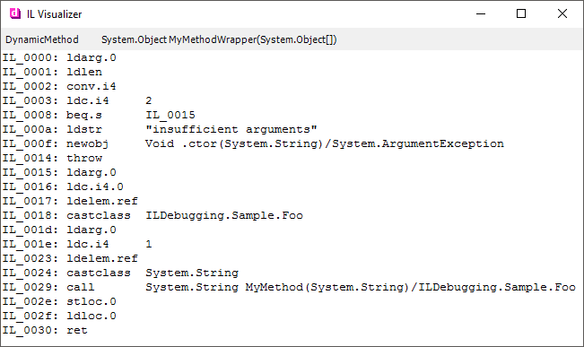

# IL Visualiser

Originally developed by Haibo Luo in 2005 and posted in a series of blog posts 
([part one](https://blogs.msdn.microsoft.com/haibo_luo/2005/10/25/debuggervisualizer-for-dynamicmethod-show-me-the-il/),
[part two](https://blogs.msdn.microsoft.com/haibo_luo/2006/11/16/take-two-il-visualizer/)).

Converted to a Git repository and upgraded to Visual Studio 2015 by Drew Noakes

## Usage

When paused in the debugger, select an instance of a subclass of `MethodBase` (such as `DynamicMethod`,
`MethodBuilder`, `ConstructorBuilder`, ...) and launch a visualiser:

There are two ways to use this visualiser.

### IL Visualizer (Modal)

Selecting _"IL Visualizer"_ pops up a window showing the IL code.

This window is modal and debugging may only continue once the window is closed.

### Out of Process (Non-modal)

Sometimes you don't want to close the window before continuing your debugging session. For such cases, you 
can run _IL Monitor_ as a separate process, then select _"Send to IL Monitor"_:

IL Monitor is a standalone MDI application that allows displaying mutliple IL views.

## Installation

(Notes apply to Visual Studio 2015, but are similar for earlier versions)

Build and copy `ILDebugging.Decoder.dll` and `ILDebugging.Visualizer.dll` to either:

> %USERPROFILE%\Documents\Visual Studio 2015\Visualizers

or

> _VisualStudioInstallPath_\Common7\Packages\Debugger\Visualizers

Then restart the debugging session.

If you wish to use _IL Monitor_, you must compile and run that executable before attempting to use it.

## Earlier Visual Studio Versions

You can target earlier versions of Visual Studio by updating the assembly references for
`Microsoft.VisualStudio.DebuggerVisualizers.dll` to the relevant version.

## License

THE CODE IS PROVIDED "AS IS", WITH NO WARRANTIES INTENDED OR IMPLIED. USE AT YOUR OWN RISK!